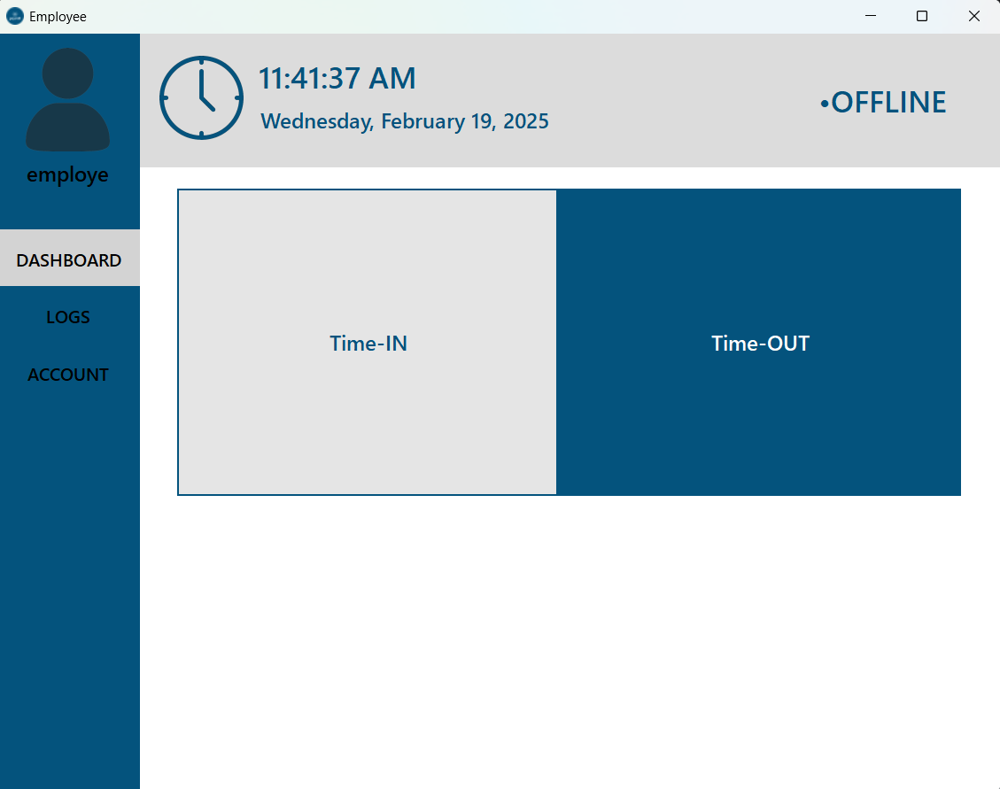
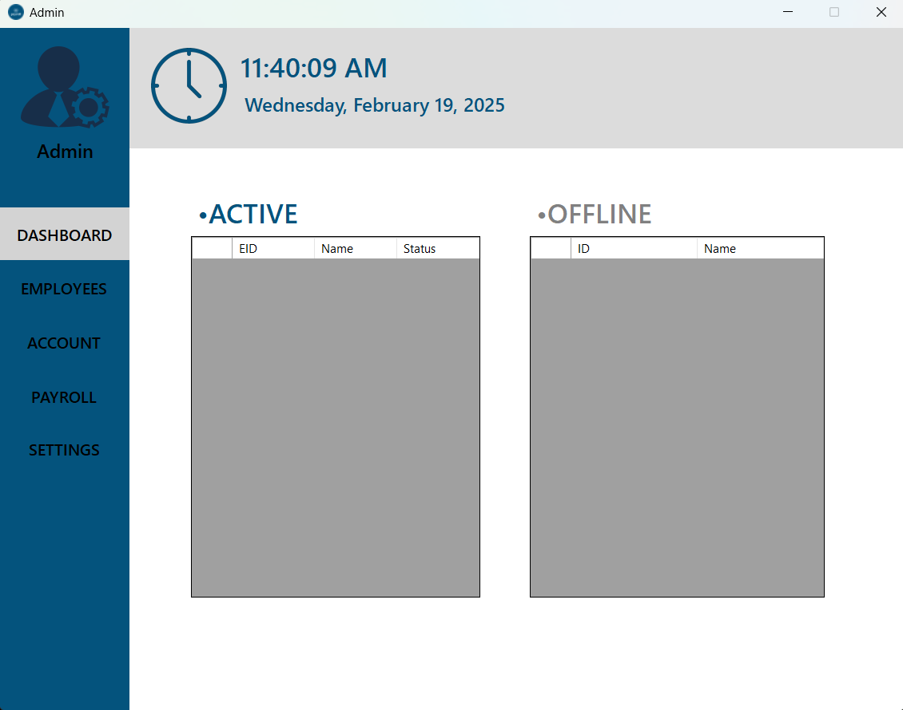

# Payroll Management System

## Overview
A C#-based payroll management system with separate interfaces for employees and administrators, designed to efficiently track work hours and manage payroll calculations.

## Features

### Employee Interface
- View time-in and time-out history
- Export attendance history to Excel
- Automatic calculation of earnings based on hourly rate
- Request edits to time-in and time-out records (pending admin approval)

### Admin Interface
- Create and manage employee accounts
- View employee attendance history
- Receive notifications for late time-ins or late time-outs
- Edit employee time-in and time-out records with employee authorization
- Modify hourly pay rate
- Add or deduct contributions such as tax, SSS, and PhilHealth

## About the Project  
This project was developed during my second year of college for the subject *Application Development and Emerging Technologies*. It applies key concepts such as time tracking, payroll calculations, and user management in a real-world scenario.

## Installation and Usage
1. Clone this repository to your local machine.
2. Open the project in Visual Studio.
3. Build and run the application.
4. Admin can create employee accounts.
5. Employees can log in and start tracking their work hours.
6. Admin can manage payroll settings and approve time change requests.

  
  

